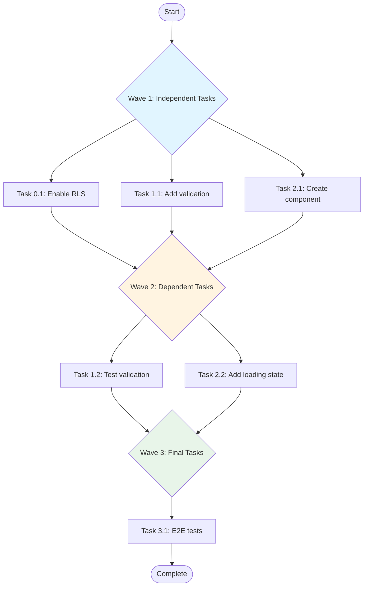
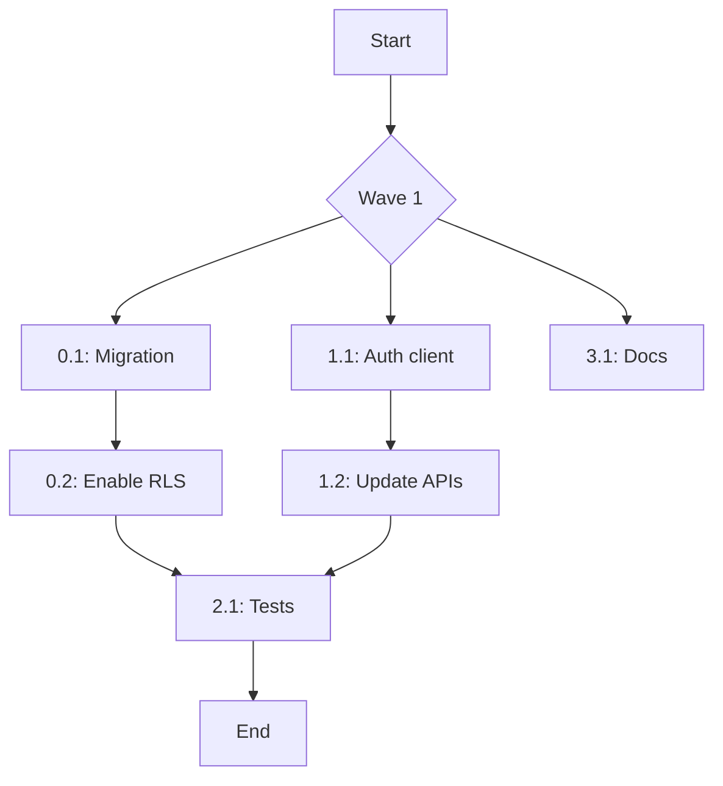

<!-- RAPIDSPEC:START -->
# Resolve Tasks in Parallel

<command_purpose>
Analyze uncompleted tasks in tasks.md, identify dependencies, and execute multiple tasks in parallel for maximum efficiency. Automatically handles task ordering based on dependencies.
</command_purpose>

<change_id> #$ARGUMENTS </change_id>

<critical_requirement>
MUST analyze task dependencies before execution.
MUST execute independent tasks in parallel.
MUST update tasks.md after each task completion.
NEVER execute dependent tasks simultaneously.
</critical_requirement>

## Main Tasks

### 1. Read and Analyze Tasks (ALWAYS FIRST)

<thinking>
First, understand what tasks remain and how they relate to each other.
Some tasks must complete before others can start.
Some tasks are completely independent and can run in parallel.
</thinking>

**Immediate Actions:**
- [ ] Read `rapidspec/changes/<change-id>/tasks.md`
- [ ] Identify uncompleted tasks (marked with `- [ ]`)
- [ ] Extract task descriptions, sections, and checkpoints
- [ ] Count total uncompleted tasks

### 2. Dependency Analysis

<thinking>
Analyze each task to determine dependencies.
Tasks that modify the same file must run sequentially.
Tasks that depend on outputs of other tasks must wait.
Independent tasks can run in parallel for speed.
</thinking>

**Dependency Rules:**

1. **File Dependencies**
   - If Task A and Task B modify the same file → Sequential
   - If Task A creates file that Task B uses → Sequential (A before B)

2. **Logical Dependencies**
   - If Task B description mentions Task A → Sequential (A before B)
   - If Task requires "after X" → Sequential

3. **Section Dependencies**
   - Critical fixes (Section 0) → Run first
   - Implementation sections → Can often run in parallel
   - Testing/Validation → Usually run after implementation

4. **Database Dependencies**
   - Migrations must run in order
   - Schema changes before queries using new schema

**Dependency Detection:**

Check each task for:
- File references: `src/app/api/route.ts`
- "After Task X.Y" mentions
- "Depends on" explicit markers
- Logical flow (migration → RLS → queries)

### 3. Create Execution Plan

<thinking>
Group tasks into waves based on dependencies.
Wave 1 has no dependencies (can start immediately).
Wave 2 depends on Wave 1 completion.
Within each wave, tasks run in parallel.
</thinking>

**Generate Mermaid Diagram:**



**Execution Summary:**

```
Execution Plan for <change-id>:

Total Tasks: 6 uncompleted
Execution Waves: 3

Wave 1 (Parallel - 3 tasks):
  - Task 0.1: Enable RLS on smart_links table (20 min)
  - Task 1.1: Add duplicate validation (15 min)
  - Task 2.1: Create DuplicateToast component (10 min)
  → Est. Time: 20 min (longest task)

Wave 2 (Parallel - 2 tasks) - Depends on Wave 1:
  - Task 1.2: Test validation logic (10 min)
  - Task 2.2: Add loading state to page (5 min)
  → Est. Time: 10 min

Wave 3 (Sequential - 1 task) - Depends on Wave 2:
  - Task 3.1: E2E test for duplicate prevention (15 min)
  → Est. Time: 15 min

Total Estimated Time: 45 min (vs 75 min if sequential)
Efficiency Gain: 40% faster

Continue with parallel execution? (yes/no/adjust)
```

### 4. Execute in Parallel

<thinking>
For each wave, spawn Task agents in parallel.
Each agent works on one task independently.
Wait for all agents in current wave to complete before starting next wave.
Update tasks.md after each wave completion.
</thinking>

**Wave Execution Pattern:**

**Wave 1 (all run simultaneously):**
```
Launching Wave 1 (3 tasks in parallel)...

1. Task pr-comment-resolver(task_0_1_enable_rls)
2. Task pr-comment-resolver(task_1_1_add_validation)
3. Task pr-comment-resolver(task_2_1_create_component)

→ Waiting for all 3 agents to complete...
```

**After Wave 1 Completes:**
```
✅ Wave 1 Complete (3/3 tasks done)

Results:
  ✓ Task 0.1: RLS enabled and tested
  ✓ Task 1.1: Validation function added
  ✓ Task 2.2: DuplicateToast component created

Updated tasks.md:
  - [x] Task 0.1
  - [x] Task 1.1
  - [x] Task 2.1

Files changed: 4 files
Tests run: 8 tests passing

┌─────────────────────────────────────────────────────────┐
│ Progress: 3/6 tasks complete | 2 waves remaining        │
│ Time elapsed: 18 min | Est. remaining: 25 min           │
└─────────────────────────────────────────────────────────┘

Starting Wave 2...
```

### 5. Handle Failures and Blockers

<thinking>
If a task fails, dependent tasks in next waves cannot proceed.
User needs to decide: fix now, skip, or abort.
</thinking>

**Failure Handling:**

If Task 1.1 fails:
```
❌ Wave 1 Task Failed: Task 1.1 (Validation function)

Error: Type error in validateSmartLink
Location: src/lib/validation.ts:45
Details: Property 'release_id' does not exist on type 'SmartLink'

Impact:
  - Task 1.2 (Test validation) → BLOCKED
  - Task 3.1 (E2E tests) → BLOCKED

Options:
1. fix-now - Stop and fix this task immediately
2. skip - Mark as failed, continue with independent tasks
3. abort - Stop all parallel execution

What to do?
```

### 6. Final Summary

After all waves complete:

```markdown
╔═══════════════════════════════════════════════════════╗
║     Parallel Execution Complete - <change-id>         ║
╚═══════════════════════════════════════════════════════╝

Execution Results:

Wave 1 (3 tasks): ✅ All passed (18 min)
Wave 2 (2 tasks): ✅ All passed (9 min)
Wave 3 (1 task):  ✅ Passed (14 min)

Total: 6/6 tasks completed
Time: 41 min (34 min saved vs sequential)

Files Changed: 8 files
  Modified: 4 files
  Added: 4 files

Tests: All passing (12 tests)
Linting: Clean

Updated: rapidspec/changes/<change-id>/tasks.md
All tasks marked [x] completed

Next Steps:
1. Review changes: git diff
2. Run full test suite: npm test
3. Review implementation: /rapid:review <change-id>
4. Commit changes: /rapid:commit <change-id>
```

## Agent Selection

**For each task, use the appropriate resolver agent:**

**Code changes:**
- Task pr-comment-resolver - General code fixes and improvements

**Database changes:**

**Component/UI changes:**
- Task nextjs-architecture-expert - Components, routes, layouts

**Complex refactoring:**
- Use general-purpose agent for multi-step changes

## Examples

### Example 1: Simple Parallel Execution

```
You: "/rapid:resolve-parallel add-smart-links"

AI:
Reading tasks.md...
Found 4 uncompleted tasks

Analyzing dependencies...
✓ Task 1.1: Create validation (independent)
✓ Task 1.2: Test validation (depends on 1.1)
✓ Task 2.1: Create component (independent)
✓ Task 2.2: Add loading state (depends on 2.1)

Execution Plan:

Wave 1 (2 tasks in parallel):
  - Task 1.1: Create validation (15 min)
  - Task 2.1: Create component (10 min)

Wave 2 (2 tasks in parallel):
  - Task 1.2: Test validation (5 min)
  - Task 2.2: Add loading state (5 min)

Total: 30 min (vs 35 min sequential)

Continue? (yes)

You: "yes"

AI:
Launching Wave 1...
1. Task pr-comment-resolver(task_1_1)
2. Task pr-comment-resolver(task_2_1)

[Both agents work in parallel]

✅ Wave 1 Complete (2/2)
✓ Task 1.1: Validation created
✓ Task 2.1: Component created

Launching Wave 2...
1. Task pr-comment-resolver(task_1_2)
2. Task pr-comment-resolver(task_2_2)

✅ Wave 2 Complete (2/2)

╔═══════════════════════════════════════════════════════╗
║            All Tasks Complete - 4/4                   ║
╚═══════════════════════════════════════════════════════╝
```

### Example 2: Complex Dependencies

```
You: "/rapid:resolve-parallel fix-auth-flow"

AI:
Reading tasks.md...
Found 6 uncompleted tasks

Analyzing dependencies...
✓ Task 0.2: Enable RLS (depends on 0.1)
✓ Task 1.1: Update auth client (independent)
✓ Task 1.2: Update API routes (depends on 1.1)
✓ Task 2.1: Add tests (depends on 0.2, 1.2)
✓ Task 3.1: Update docs (independent)

Execution Plan:


Wave 1 (3 parallel): 0.1, 1.1, 3.1 → 20 min
Wave 2 (2 parallel): 0.2, 1.2 → 15 min
Wave 3 (1 task): 2.1 → 10 min

Total: 45 min (vs 70 min sequential)

Continue? (yes)
```

### Example 3: Handling Failure

```
Wave 1 launched...
✓ Task 0.1: Migration succeeded
❌ Task 1.1: Auth client failed (type error)
✓ Task 3.1: Docs updated

Impact: Task 1.2 and Task 2.1 blocked

Options:
1. fix-now
2. skip (continue with 0.2 only)
3. abort

You: "fix-now"

AI:
Stopping parallel execution...
Opening task 1.1 for debugging...

[Shows error details]

Would you like to:
1. Fix manually then resume
2. Let me try to fix
3. Abort entire parallel execution

You: "2"

AI:
Analyzing error...
Issue: Missing import for 'createBrowserClient'

Applied fix. Running tests...
✓ Tests passing

Resume parallel execution? (yes)

You: "yes"

AI: Resuming from Wave 2...
```

## Anti-Patterns

❌ **Don't: Ignore dependencies**
```
Bad: Run all tasks in parallel regardless of dependencies
→ Task B fails because Task A didn't complete first
```

✅ **Do: Analyze dependencies first**
```
Good: Create execution plan → Waves → Parallel within waves
```

❌ **Don't: Continue on critical failures**
```
Bad: Migration fails → Continue with queries
→ Queries fail because table doesn't exist
```

✅ **Do: Stop and fix blockers**
```
Good: Migration fails → Stop dependent tasks → Fix → Resume
```

## Reference

- Use after `/rapid:triage` to fix multiple accepted findings efficiently
- Use during `/rapid:apply` for large features with many independent tasks
- Dependency analysis prevents breaking changes
- Parallel execution saves significant time (30-50% faster)
- Always update tasks.md after each wave completion

<!-- RAPIDSPEC:END -->
